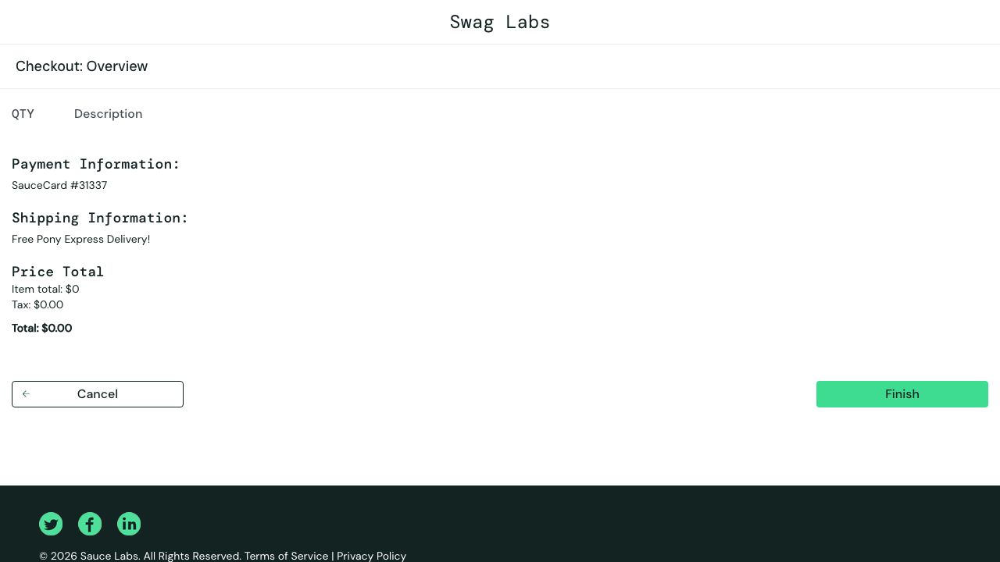
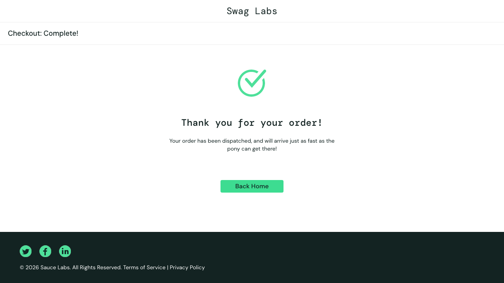

# BUG-001: Checkout completes successfully with an empty cart

| Field        | Value                          |
|--------------|--------------------------------|
| **ID**       | BUG-001                        |
| **Severity** | High                           |
| **Priority** | High                           |
| **Status**   | Open                           |
| **Reported** | 2026-06-29                     |
| **Reporter** | Jirat Fuangfu                       |
| **Module**   | Checkout                       |

## Summary
ระบบอนุญาตให้ผู้ใช้ทำ checkout จนจบและได้รับการยืนยันคำสั่งซื้อสำเร็จ
ทั้งที่ตะกร้าสินค้า (cart) ว่างเปล่า ไม่มีสินค้าใด ๆ

## Environment
- **Application:** SauceDemo (https://www.saucedemo.com)
- **Browser:** Chromium [ใส่เวอร์ชัน]
- **User:** standard_user

## Preconditions
- ผู้ใช้ login ด้วย `standard_user` สำเร็จ
- ตะกร้าสินค้าว่าง (ไม่มีสินค้าใน cart)

## Steps to Reproduce
1. Login เข้าระบบด้วย `standard_user` / `secret_sauce`
2. โดยไม่หยิบสินค้าใด ๆ คลิกไอคอนตะกร้า (cart) เพื่อเข้าหน้า Your Cart
3. คลิกปุ่ม **Checkout**
4. กรอกข้อมูล First Name / Last Name / Postal Code แล้วคลิก **Continue**
5. ที่หน้า Overview คลิกปุ่ม **Finish**

## Expected Result
ระบบควรป้องกันการ checkout เมื่อ cart ว่าง เช่น ปิดการใช้งานปุ่ม Checkout
หรือแสดงข้อความแจ้งเตือนว่าไม่มีสินค้าในตะกร้า และไม่ควรสร้างคำสั่งซื้อได้

## Actual Result
ระบบดำเนินการ checkout จนจบและแสดงหน้า order complete พร้อมข้อความ
"Thank you for your order!" ทั้งที่ไม่มีสินค้าในตะกร้า (URL: /checkout-complete.html)

## Evidence

## Notes
พบระหว่างทำ exploratory testing ของ checkout flow (edge case: cart ว่าง)
กระทบ business logic โดยตรง เนื่องจากสร้างคำสั่งซื้อที่ไม่มีสินค้าได้
